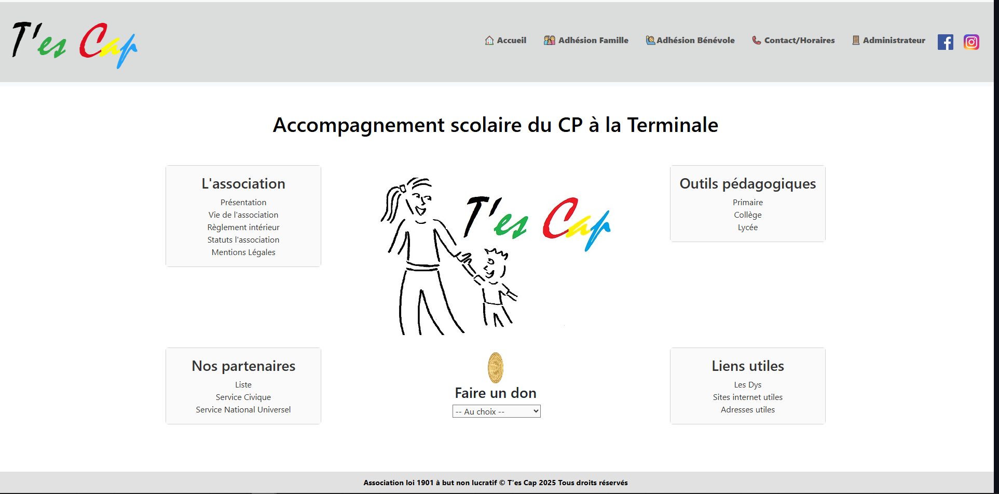
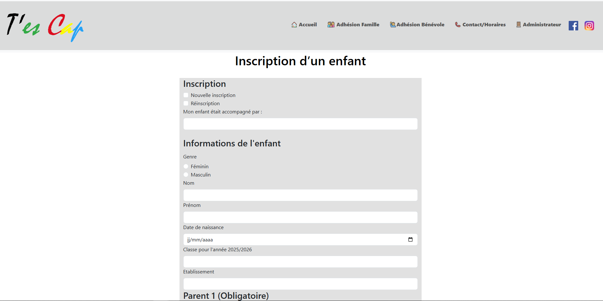
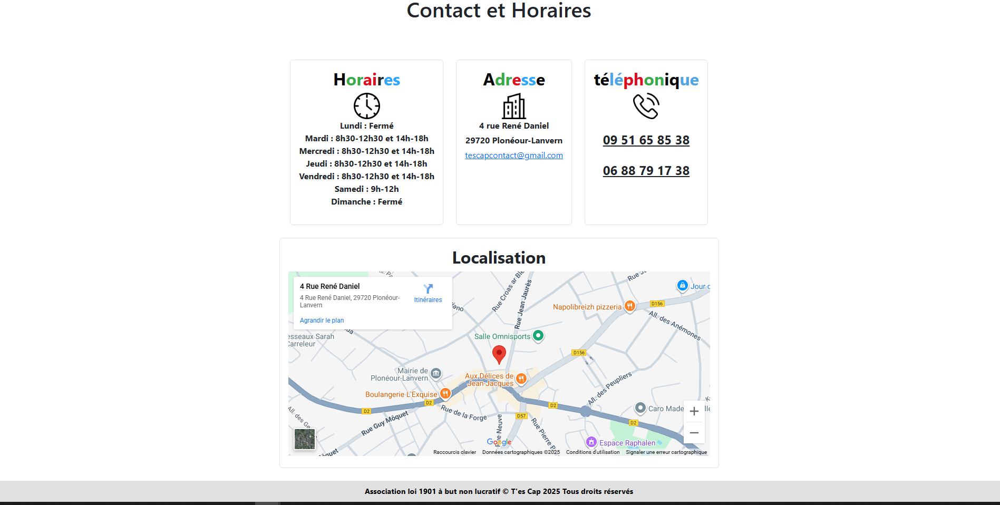

### <h1 align="center"> T'es Cap - Portfolio Symfony</h1>

Présentation du projet

L’association « T’es Cap » a pour objectif d’accompagner les enfants et adolescents rencontrant des difficultés scolaires, et de prévenir le risque de décrochage.
Elle propose un suivi personnalisé allant du CP à la Terminale, et met à disposition un large éventail de ressources pédagogiques adaptées.

Fonctionnalités principales du site

- Présentation de l’association : informations sur sa mission et ses actions.

- Connexion administrateur : un espace sécurisé pour la gestion interne.

- Popup d’accueil : pour mettre en avant les informations importantes.

- Ressources pédagogiques : des dizaines de pages de contenus pour le primaire, le collège et le lycée.

- Infos et documentation : explications sur les différents troubles Dys, liens vers des sites utiles et contacts d’associations partenaires.

- Formulaire d’inscription : pour que les familles et les bénévoles puissent rejoindre facilement l’association.

- Dons en ligne : possibilité de soutenir l’association via HelloAsso.

- Base de données : la coordinatrice dispose d’un accès avancé avec des vues personnalisées, ainsi que des outils de recherche et de filtrage.

## Lien vers le site en ligne
[Voir le site](https://tescap29.fr/accueil)

## Capture d'écran

### Page d'accueil

### Page enfant inscription

### Page Contact

## Description
- Symfony version 6.4.24
- PHP 8.2.12 (cli)
- Base de données : MariaDB 11.4.8
- Frontend responsive, HTML, CSS, JS
- Pages : Packages PHP : Twig, Doctrine, etc.
  
